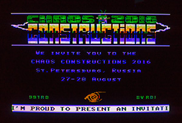

# 99tro
99tro by Frog //ROi 
22k invitation intro to Chaos Constructions'2016 for TI-99/4a 
Released at Revision'2016 

Platform: TI-99/4a home computer (NTSC) 
Required typical config: 32K RAM expansion (using NanoPEB, for example) and Editor/Assembler cartridge to run object file. 

Intro runs on real hardware and with MESS/MAME/js99er emulators

Use xas99 to assemble

If you don't have TI-99/4a, check out Youtube video: https://www.youtube.com/watch?v=NR0YOCODR7g

Credits for this intro:

Code/graphics: Frog 
Music: Jrlepage 
Sound player: Tursi    
Text editing: Draugven 
Couriers: Random, Draugven, Hun7er 
atariage.com TI community - for info       
Tnt23 and Riddle - for supplying hardware

License: MIT
